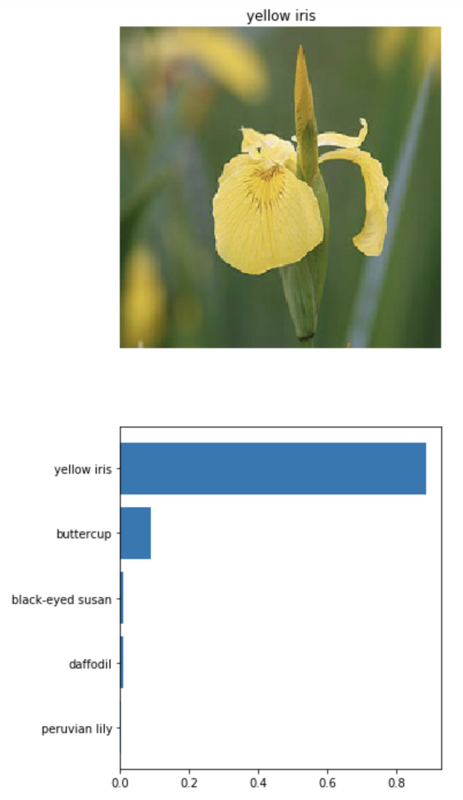

# PyTorch_Image_Classifier

## Motivation

Train an image classifier using PyTorch to recognize different species of flowers.

## Dataset

102 Category Flower Dataset available at http://www.robots.ox.ac.uk/~vgg/data/flowers/102/index.html. Each class consists of between 40 and 258 images.

## Jupyter Notebook

Trained VGG16 with transfer learning using PyTorch to identify 102 different flower species. Created new classifier layer and checkpoints to save and load the model.  Then displayed the test image along with a bar chart of the top k class probabilities.

## Command Line Interface

Next, I transformed the Jupyter notebook into Python files that could be run from the command line and allowed end users to pass several optional parameters, such as the learning rate, number of epochs, whether to use a GPU for training, the model architecture (VGG16, Densenet121), and the path to save a checkpoint. Utilized argparse library to handle these optional and positional arguments from the command line. The predict.py file also allowed the user to specify the number of top classes they would like to examine. It also allowed for GPU training and to pass in a file with the category names to allow for mapping to real category names.
